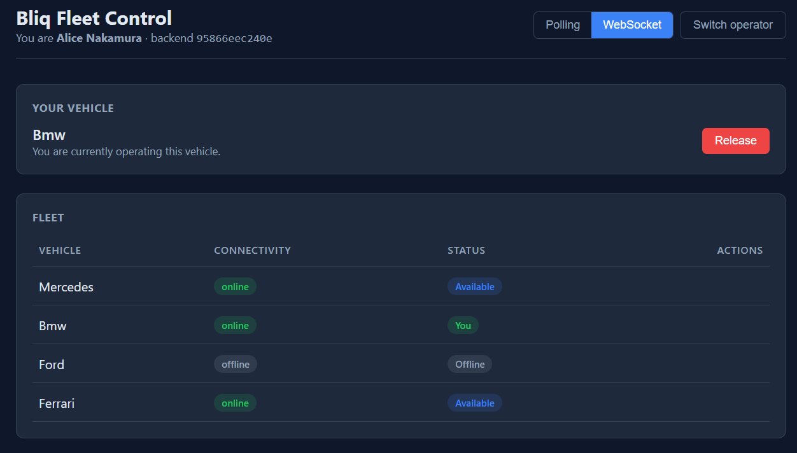
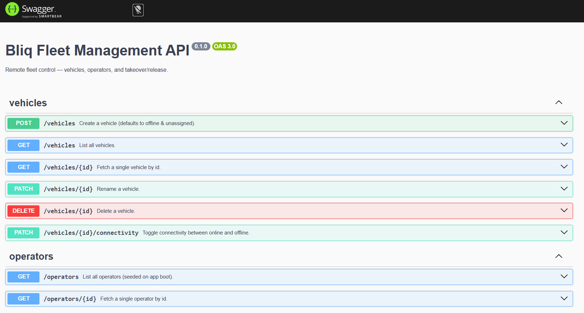
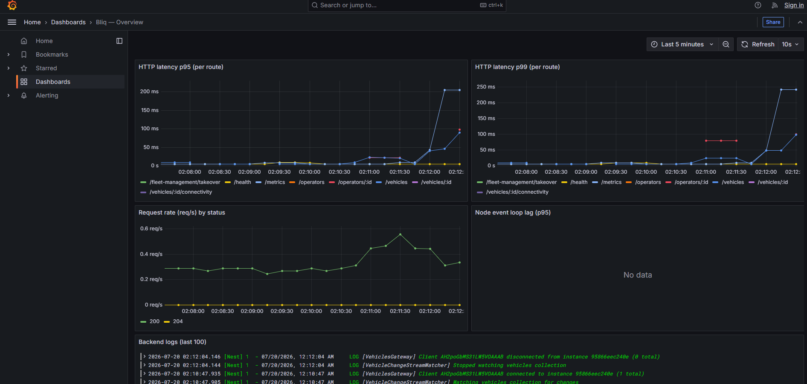

# Bliq

Remote fleet control: a small service and two web dashboards that let a pool
of remote operators sign in, pick a vehicle from the fleet, and operate it,
with hard guarantees that no two operators ever hold the same vehicle at the
same time.

- **Backend** (`apps/backend`): NestJS + MongoDB. Vehicle & operator CRUD,
  transactional takeover / release, WebSocket real-time updates.
- **Operator dashboard** (`apps/operator-dashboard`): React + Vite. Operators
  sign in, take over vehicles, release them. Live via WebSocket by default,
  falls back to HTTP polling automatically.
- **Admin dashboard** (`apps/admin-dashboard`): React + Vite. Add vehicles,
  toggle connectivity, delete. Polling only, kept intentionally simple.

## Table of contents

1. [Quick start](#quick-start)
2. [Definition of done](#definition-of-done)
3. [Requirements](#requirements)
4. [Repository layout](#repository-layout)
5. [System architecture](#system-architecture)
6. [Fleet management service architecture](#fleet-management-service-architecture)
7. [Concurrency & consistency](#concurrency--consistency)
8. [API reference](#api-reference)
9. [Real-time updates](#real-time-updates)
10. [Testing](#testing)
11. [Observability](#observability)
12. [Containerised components](#containerised-components)
13. [Contribution workflow](#contribution-workflow)
14. [Assumptions & optional paths taken](#assumptions--optional-paths-taken)
15. [Future optimisations](#future-optimisations)

---

## Quick start

**Prerequisites: [Docker](https://docs.docker.com/get-started/get-docker/) with Compose v2 and [Node 22](https://nodejs.org/).**

```bash
# Once, on a fresh clone:
npm run full:install

# Every time you want to work:
npm run full:dev
```

`full:install` installs the frontend dependencies (the backend runs in Docker; no local install needed).

`full:dev` starts the whole stack:

1. Builds the backend Docker image and starts the full stack:
   - 2 NestJS replicas behind **Nginx** on `http://localhost:8090`
   - **MongoDB** replica set
   - **Nginx** load balancer (reverse proxy)
   - **Prometheus** · **Loki** · **Promtail** · **Grafana** observability stack 
3. Launches both frontends as Vite dev servers pointed at the Nginx backend.

Once everything is up:

| Service | URL | Description |
|---------|-----|-------------|
| **Operator dashboard** | http://localhost:5173 | For remote operators. Select your operator identity, browse the live vehicle list, take over an available vehicle, and release it when done. Updates arrive in real time via WebSocket (falls back to polling if the socket drops). |
| **Admin dashboard** | http://localhost:5174 | For fleet administrators. Add new vehicles, toggle any vehicle between online and offline, and delete vehicles that are no longer in service. |
| **Grafana** | http://localhost:3001 | Observability UI: HTTP latency histograms, request rates, and container logs. |
| **Prometheus** | http://localhost:9090 | Raw metrics scrape endpoint and query UI. |
| **Backend API** | http://localhost:8090 | REST + WebSocket, load-balanced across 2 replicas by Nginx. Swagger docs at [/docs](http://localhost:8090/docs). |





**To stop:** `Ctrl+C` kills the frontends; then `npm run full:down` tears down the Docker stack.

---

## Definition of done

### Functional requirements

| # | Requirement | Notes |
|---|-------------|-------|
| 1 | Vehicle CRUD | `POST /vehicles`, `GET /vehicles`, `GET /vehicles/:id`, `PATCH /vehicles/:id`, `DELETE /vehicles/:id`, `PATCH /vehicles/:id/connectivity` |
| 2 | Operator CRUD | Operators are seeded on boot (4 fixed operators). Read-only `GET /operators` + `GET /operators/:id` API. See [Assumptions](#assumptions--optional-paths-taken) for rationale. |
| 3 | Vehicle takeover / release | `POST /fleet-management/takeover`, `POST /fleet-management/release` with the acting operator identified by `X-Operator-Id` header |

### Invariants that must always hold

These three invariants must be unbreakable under any concurrent load:

- **I1**: A vehicle is assigned to **at most one** operator at any point in time.
- **I2**: An operator holds **at most one** vehicle at any point in time.
- **I3**: A vehicle **cannot go offline** while it is assigned; the operator must release it first.

Business rules encode preconditions that protect these invariants:

- A vehicle can only be taken over if it is **online** and **unassigned**.
- An operator can only take a vehicle if they currently hold **no vehicle**.
- A vehicle can only go offline if it is **unassigned**.

Where the rules live and how they are enforced at runtime is described in
[Fleet management service architecture](#fleet-management-service-architecture)
and [Concurrency & consistency](#concurrency--consistency).

---

## Requirements

### Non-functional requirements

| Dimension | Target | Implementation |
|-----------|--------|----------------|
| **CAP** | Consistency **>>** Availability | Reads from primary only; MongoDB transactions with `majority` write concern. If all replicas are down the service returns an error; it never serves stale takeover state. |
| **Real-time / latency** | Sub-second vehicle state propagation to connected clients | MongoDB change streams → `EventEmitter2` → socket.io broadcast. p95 UI update < 1 s for up to a few hundred connected clients. |
| **Extensibility** | SOLID, independently replaceable components | Clean architecture (see [service architecture section](#fleet-management-service-architecture)). |
| **API contract** | Explicitly typed request / response shapes | Swagger UI at `/docs` (dev), class-validator DTOs, stable typed error codes. |
| **SLOs** | Uptime 99.9%, p95 response time ≤ 5 s, WebSocket with polling fallback | v1 is a single backend; see v2 for the infrastructure path to 99.9%. Fallback polling at 5 s is implemented in the operator dashboard. |
| **Observability** | Unified monitoring across components | Structured `NestLogger`, `LoggingInterceptor` on every HTTP request, gateway lifecycle events. See [Observability](#observability) for the production roadmap. |

---

## System architecture

### Version 1: monolith


**Components:**
- One **NestJS** monolith handling all HTTP and WebSocket traffic.
- One **MongoDB** instance (single-node replica set; required for transactions
  even in dev; see compose setup).

**Limits of v1:**
- **Single point of failure**: one backend, one Mongo instance. Any crash
  takes down the entire service.
- **No zero-downtime deploys**: a restart disconnects all WebSocket clients
  and interrupts any in-flight request.
- **No horizontal scaling**: the WebSocket state is in memory; a second
  backend instance would not share it.
- **No A/B testing or canary deploys**: impossible without a load balancer
  in front.

---

### Version 2: replicated


**Changes over v1:**
- **MongoDB replica set (3 nodes)** with `majority` write concern; a write is
  only acknowledged after at least 2 of 3 nodes have persisted it. The primary
  can crash and a secondary promotes automatically without data loss.
- **3 NestJS instances** behind a load balancer. Each instance runs its own
  MongoDB change stream and broadcasts to its own connected WebSocket clients.
  Adding a socket.io Redis adapter propagates broadcasts cluster-wide.
- **Nginx** as a reverse proxy and load balancer: TLS termination, sticky
  sessions for WebSocket connections (or use the Redis adapter to make sessions
  stateless), and health-check-based failover.
- **Observability stack** with centralized logging: metrics, distributed traces, and application logs
  provide end-to-end visibility into request flows, service health, and
  performance across the cluster.

**Limits of v2:**
- **Load balancer is still a single point of failure**: mitigated with an
  active-passive Nginx pair or a cloud load balancer (ALB, GCP LB).
- **No database sharding**: once the vehicles collection grows into the
  millions, a sharded cluster becomes necessary. At fleet management scale
  this is unlikely to be the first bottleneck.
- **Change stream duplication**: 3 NestJS instances each run their own stream
  and each broadcast to their clients. This is fine with a Redis adapter but
  could be restructured into a dedicated broadcaster tier.

---

## Fleet management service architecture


### Clean architecture

The service is structured around clean architecture: outer layers depend on
inner layers, never the reverse.

```
apps/backend/src/
├── domain/                  Entities, rule predicates, repository & service abstracts,
│                            typed DomainError hierarchy. Pure TypeScript, no framework.
│
├── data-access/             Mongoose schemas, mappers, repository implementations,
│                            change-stream watcher.
│
├── services/                Cross-aggregate implementations that need infra
│                            (currently: MongoFleetAssignmentService with transactions).
│
├── apis/                    Controllers, DTOs, feature modules, WebSocket gateway,
                             exception filter, interceptor, metrics providers.
```

Replacing MongoDB with PostgreSQL only touches `data-access/`. Business rules in `domain/*/rules.ts` are pure functions with no framework dependency, reused by the service layer and tests. Swapping in a test double is done at the module level, not by patching imports.

`MongoFleetAssignmentService` intentionally reaches into `mongoose.ClientSession`; enforcing strong consistency requires coupling to the transaction primitive, and hiding it behind another abstraction would just add indirection.

### Vehicle & operator entities

- **Vehicle**: `{ id, name, connectivityStatus: 'online' | 'offline', assignedOperatorId: string | null }`.
- **Operator**: `{ id, name, currentVehicleId: string | null }`.

`assignedOperatorId` on the vehicle and `currentVehicleId` on the operator are
deliberately denormalised, the same relationship expressed twice. This makes
the "at most one vehicle per operator" invariant enforceable with a single
guarded write on the operator document, and lets both the UI and the API
answer "who is driving what" in one document read.

### Domain rules

Business rules live as pure functions in `domain/*/rules.ts`, one source of
truth, reusable from the service layer, the exception filter, and tests:

- `canBeAssigned(vehicle)`: vehicle is online AND unassigned
- `canGoOffline(vehicle)`: vehicle is unassigned
- `canClaimVehicle(operator)`: operator holds no vehicle
- `isHolding(operator, vehicleId)`: operator currently holds this vehicle

### Domain errors → HTTP

Domain-level errors are typed and carry two stable fields:

- `code` (`VEHICLE_OFFLINE`, `VEHICLE_ALREADY_ASSIGNED`,
  `OPERATOR_ALREADY_HAS_VEHICLE`, `VEHICLE_NOT_HELD_BY_OPERATOR`,
  `VEHICLE_NOT_FOUND`, `OPERATOR_NOT_FOUND`)
- `kind` (`'not-found' | 'conflict' | 'invalid' | 'unauthorized' | 'forbidden'`)

A global `DomainExceptionFilter` maps `kind` to HTTP status via a small closed
table and returns `{ statusCode, code, message }`. Adding a new domain error
never touches the filter; the mapping is by category, not per-code. The
filter guards on `host.getType()` so a future non-HTTP transport (WebSocket
handlers, RPC) doesn't get an accidental HTTP response applied to it.

The frontend switches on `code` (not on English message text) to render
specific rejection reasons in toasts.

---

## Concurrency & consistency

Three invariants have to hold under any sequence of concurrent requests:

1. A vehicle is assigned to at most one operator at any time.
2. An operator holds at most one vehicle at any time.
3. A vehicle cannot be offline while assigned.

### Why the naïve solution doesn't work

A naïve implementation might:

1. Read the vehicle document, check it is online and unassigned.
2. Read the operator document, check they hold no vehicle.
3. Write the vehicle: set `assignedOperatorId`.
4. Write the operator: set `currentVehicleId`.

Under concurrent requests this produces **lost updates**:

```
Time  Request A (Op1 → V1)         Request B (Op2 → V1)
  1   read V1  → unassigned        read V1  → unassigned   (both see "free")
  2   check rules → pass           check rules → pass
  3   write V1.assignedOperatorId = Op1
  4                                write V1.assignedOperatorId = Op2  ← overwrites!
  5   write Op1.currentVehicleId = V1
  6                                write Op2.currentVehicleId = V1
  →   Both operators now hold V1. Invariant I1 broken.
```

### How consistency is enforced

**Takeover / release: MongoDB multi-document transaction:**

`MongoFleetAssignmentService` opens a MongoDB `ClientSession` and wraps the
entire read-check-write sequence in `session.withTransaction`:

- Both reads use `.session(session)` so they observe a **consistent snapshot**
  (MongoDB uses MVCC; snapshot isolation is the default for multi-document
  transactions).
- Rule predicates from `domain/*/rules.ts` run against the snapshot.
- Both writes happen inside the same transaction with `majority` write concern.
- If two concurrent transactions target the **same document**, MongoDB detects
  the write conflict and automatically retries the loser.
- On retry, the loser's fresh read observes the winner's committed state; the
  rule check now fails; the transaction aborts with a typed `DomainError`. No
  partial writes, no silent lost update.

**Connectivity toggle: single-document atomic guard:**

```ts
findOneAndUpdate({ _id, assignedOperatorId: null }, { connectivityStatus: 'offline' })
```

If a race is lost (the vehicle was just taken) the update matches nothing and
the caller re-reads and produces a precise `VEHICLE_ALREADY_ASSIGNED` error.

### Consistency model

| Scope | Guarantee |
|-------|-----------|
| Takeover / release | Strong: all reads from primary within session; both writes commit together or neither does |
| Connectivity toggle | Atomic: single guarded `findOneAndUpdate` |
| Client UI | Eventually consistent, almost instantaneous. WebSocket clients receive `vehicle.changed` within tens of milliseconds. |

Any client acting on stale UI is safely rejected by the backend with a domain
error code the client can display.

### Limits of the transactions approach

- **Consistency is tied to the database**: the invariants are enforced inside
  MongoDB. A service that bypasses the backend and writes directly to the
  collection breaks the guarantees.
- **Transactions don't cross service boundaries**: if a second service (e.g.,
  a billing service) needs to participate in the same atomic operation,
  MongoDB transactions can't span it. A saga pattern or an outbox pattern
  would be needed.
- **Throughput**: multi-document transactions add latency (round-trip + lock
  acquisition). For the expected fleet management scale (hundreds of operators,
  not hundreds of thousands) this is fine. At higher throughput, the next step
  would be:

### Alternative: distributed locking with Redis

---

## Real-time updates

The operator dashboard subscribes to a WebSocket namespace `/realtime` and
receives:

- `vehicles.snapshot` (on connect): current full list
- `vehicle.changed` (broadcast): `{ kind: 'created'|'updated'|'deleted', vehicleId, vehicle }`

### Server-side pipeline

1. **`VehicleChangeStreamWatcher`** in `data-access/vehicles/` opens a MongoDB
   change stream on the vehicles collection when the first WebSocket client
   connects, and stops it when the last one disconnects. No idle Mongo cursor
   when no one is watching.
2. Each raw Mongo event is translated to a domain `VehicleChangedEvent` and
   emitted on the app-wide `EventEmitter2`. This decouples the data-access
   watcher from the WebSocket gateway; neither knows about the other.
3. **`VehiclesGateway`** in `apis/vehicles/` subscribes with
   `@OnEvent('vehicle.changed')` and broadcasts to every socket in `/realtime`.

Using change streams as the event source means **every write** is captured
regardless of who wrote it: a service, an admin CLI, or another backend
instance. This also makes horizontal scaling straightforward: each backend
instance runs its own stream and broadcasts to its own connected clients. A
socket.io Redis adapter propagates the broadcast cluster-wide (see v2 notes).

### Frontend fallback

The operator dashboard defaults to WebSocket. If the initial connect fails
(or all reconnect attempts are exhausted mid-session), it falls back to
5-second HTTP polling and shows an error toast with the underlying reason.
Users can retry WebSocket by clicking the toggle in the header.

---

## Testing

```bash
npm --prefix apps/backend test
```

Three suites, ~15 seconds total against `mongodb-memory-server`.

### Strategy

- **Domain rules** (`vehicle.rules.spec.ts`, `operator.rules.spec.ts`): pure
  unit tests for the rule predicates. No mocks, no framework, no DB. These
  test the invariant logic in total isolation.

- **Assignment service** (`mongo-fleet-assignment.service.spec.ts`): integration tests against a real single-node MongoDB replica set spun up
  by `mongodb-memory-server`. This is where the interesting guarantees live:
  - Full takeover decision table (happy path + every rule violation)
  - Every failure path also asserts the DB state was **not** mutated
    (atomicity is the invariant being tested, not just the error thrown)
  - Release happy path + non-holder rejection
  - **Two concurrency tests**:
    - Two operators race for the same vehicle → exactly one wins, the loser
      receives `VehicleAlreadyAssignedError`, the loser's `currentVehicleId`
      remains `null`.
    - One operator races to take two different vehicles simultaneously →
      exactly one wins, the loser receives `OperatorAlreadyHasVehicleError`,
      the loser vehicle stays unassigned.

The concurrency tests prove both sides of the "at most one" invariant under
real contention. They could not be written with fakes; the guarantee lives
in the transaction protocol, not in application code.

### What is not tested (and why)

Controllers, DTOs, and CRUD are not directly unit-tested. They would either
repeat framework behaviour (class-validator, Nest routing) or verify an obvious
delegation. Coverage-driven testing is deliberately avoided; the test surface
is chosen by where real risk lives.

### Known limitation: concurrency tests are sequential, not truly concurrent

The two "race" tests use `Promise.allSettled([callA, callB])` in a single
Node.js process. Because Node.js is single-threaded and both calls `await`
inside a Mongoose session, the event loop runs them sequentially: the first
transaction completes and commits before the second one begins its read. The
second call therefore sees already-committed state and fails the in-memory
domain-rule check; no MongoDB write-conflict is triggered.

This still catches regression errors, but it does not exercise the actual
concurrency path where two transactions read the same unassigned vehicle
simultaneously, both pass the in-memory check, and then one is rejected at
commit time by MongoDB's write-conflict detection.

To test that path properly you would need either:
- Two separate processes (or workers) racing against the same replica set.
- An injected delay between the in-memory check and the write, with a
  competing transaction committed in that window.

The behaviour under a true write conflict is described in
[Concurrency & consistency](#concurrency--consistency): `session.withTransaction`
auto-retries on `TransientTransactionError`, the retry reads the now-committed
state, the rule check fails, and a typed `DomainError` is returned, but this
path is exercised only in production load, not in the current test suite.

---

## Observability

Current implementation:

- **Nest `Logger`** with structured levels: `LOG` for normal operations,
  `WARN` for expected-but-noteworthy events (slow HTTP requests, domain
  rule rejections), `ERROR` for unexpected failures with stack traces.
- **`LoggingInterceptor`** wraps every HTTP request with method, URL,
  status/code, and duration. Requests over 500 ms are logged at `WARN`.
- **Change stream watcher and WebSocket gateway** log their own connect /
  disconnect lifecycle events with client id and current count.

Production roadmap (see also [Future optimisations](#future-optimisations)):

- **Prometheus `/metrics` endpoint**: Node runtime metrics, an
  `http_request_duration_seconds` histogram, a
  `fleet_assignment_operations_total{operation, outcome}` counter keyed by
  the domain error code, and a `fleet_websocket_connections` gauge.
- **Structured JSON logs** via Pino → Promtail → Loki for cross-instance
  search; correlation ids via `AsyncLocalStorage`.
- **OpenTelemetry traces** once a second service boundary exists.
- **Grafana** dashboards for latency percentiles, takeover success rate by
  outcome code, and live WebSocket client count.



---

## Containerised components

The current `docker-compose.yml` runs MongoDB as a single-node replica set
with a healthcheck that also handles first-time `rs.initiate()`. `npm run dev`
blocks on the healthcheck so the backend never races an unready database.

The three application components (backend, operator dashboard, admin dashboard)
are run as Node/Vite dev servers locally. Dockerising them for a production
build would involve:

- **Backend**: multi-stage `Dockerfile` (`node:22-alpine` build + distroless
  runtime), environment variables for `MONGO_URI`, `PORT`, `NODE_ENV`.
- **Frontends**: build with `vite build`, serve the `dist/` output via nginx
  or a CDN; the Vite build is a static bundle with no runtime Node.
- **Compose (v2)**: extend `docker-compose.yml` with service definitions for
  all components plus Nginx as a reverse proxy, enabling the v2 architecture
  locally with `docker compose up --scale backend=3`.

---

## Contribution workflow

### Pull request policy

Nothing lands on `main` except through a pull request. The branch is
protected: direct pushes are rejected at the GitHub side regardless of
local hook bypasses.

**Branch naming** follows the Conventional Commits scope:
`feat/`, `fix/`, `chore/`, `docs/`, `ci/` + a short slug (e.g. `feat/operator-auth`).

**Opening a PR** pre-fills [`.github/PULL_REQUEST_TEMPLATE.md`](.github/PULL_REQUEST_TEMPLATE.md):
summary, notable diffs per layer (backend / frontend / infra / docs), local
testing checklist, and notes for reviewers.

**Review**: [`.github/CODEOWNERS`](.github/CODEOWNERS) auto-requests a review
from the repo owner on every PR. At least one approval is required; stale
approvals are dismissed when new commits are pushed.

**Merge strategy**: squash or rebase only — no merge commits. Linear history
is enforced, and the head branch is deleted automatically after merge.

See [`.github/BRANCH_PROTECTION.md`](.github/BRANCH_PROTECTION.md) for the
one-time GitHub UI steps that turn these rules into hard gates.

### CI pipeline

CI runs on every pull request (not on push to `main`). In-flight runs for the
same PR are cancelled when new commits are pushed so only the latest commit
needs to prove itself green.

Three parallel jobs must all pass before merge is allowed:

| Job | Steps |
|-----|-------|
| **Backend** | `npm ci` → `tsc --noEmit` → `eslint` → `jest` (against `mongodb-memory-server`) |
| **Frontend** | `npm ci` → `tsc --noEmit` → `vite build` |
| **Commit messages** | `commitlint` against the full PR commit range |

Two local Husky hooks give developers early feedback before they push:
- `pre-commit`: Prettier via `lint-staged` on staged files.
- `commit-msg`: commitlint immediately after each commit.

---

## Assumptions & optional paths taken

A few things were left open by the spec, here's what I went with:

- **Database**: MongoDB (single-node replica set locally, required for the
  multi-document transactions the fleet-management flow uses).
- **Operators**: seeded on startup via `OperatorsSeed` (`OnApplicationBootstrap`).
  Four fixed operators, no CRUD API. Rationale: keep the surface focused on
  the actual challenge: the assignment lifecycle.
- **Auth**: the prompt allows using an operator id in the request to identify
  who is acting. Implemented as an `X-Operator-Id` HTTP header (not the
  request body), extracted by a custom `@OperatorId()` parameter decorator.
  Rationale: when JWT auth lands, only the decorator body swaps to
  `request.user.operatorId`; controllers and downstream code stay identical.
- **Frontend**: two separate Vite + React apps, one per audience (operators
  and admins). Rationale: different mental model, different eventual auth
  scope, different deploy artefacts. Sharing infra between them is easy;
  merging them would be a lie about who they serve.
- **Real-time**: MongoDB change streams + `@nestjs/event-emitter` + socket.io.
  Change streams as the source of truth means the fan-out is captured for every
  write regardless of who wrote it, and horizontal scaling is straightforward.
- **Not implemented**: real auth, response DTOs (controllers return the domain
  entity directly; its shape is flat and already API-appropriate), pagination
  on `GET /vehicles`, structured JSON logs.

---

## Future optimisations

- **Partial unique index** on `vehicles.assignedOperatorId` and `operators.currentVehicleId` as a DB-level safety net against any bug in the rule check.
- **Idempotency keys** on takeover / release so a retried request after a network blip is a safe no-op.
- **JWT auth**: the `@OperatorId()` decorator is already the only thing that would need to change; controllers stay untouched.
- **socket.io Redis adapter** once there's more than one backend instance, so broadcasts reach all connected clients regardless of which replica they hit.
- **Change stream resume tokens** persisted to Redis/Mongo so a watcher restart doesn't drop events.
- **Pagination** on `GET /vehicles` once the fleet grows past a screenful.
- **Audit log**: an append-only `assignments` collection for every takeover, release, and connectivity change.
- **Playwright E2E tests** through the full stack, proving domain error codes surface correctly in the UI.
- **`eslint-plugin-boundaries`** to enforce the layer rules structurally rather than by convention.
- **CD pipeline**: on merge to `main`, build and push the backend Docker image to a registry (Docker Hub / ECR / GCR), then trigger a rolling deploy to a staging environment. A separate release workflow deploys to production on a tagged commit, with a manual approval gate between staging and prod.

---

## License

MIT © Omar Maaref
