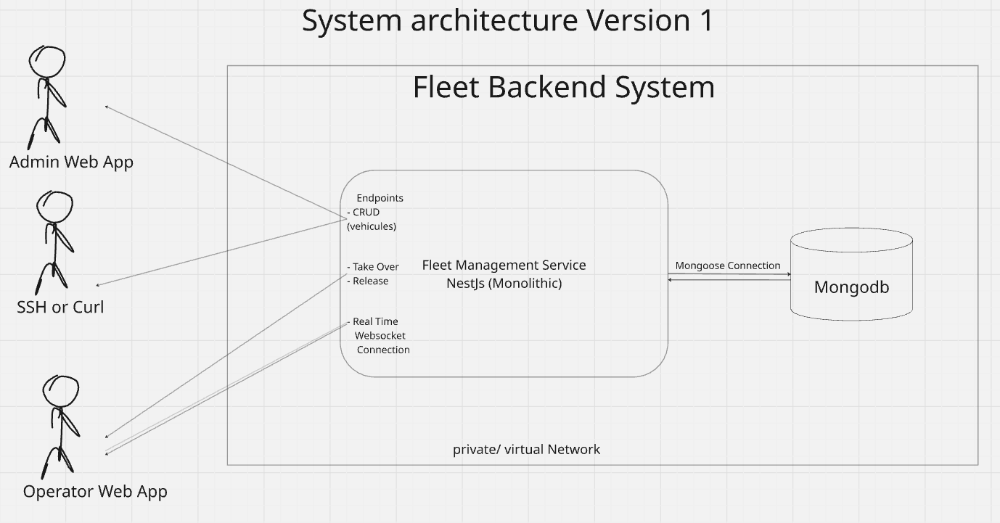
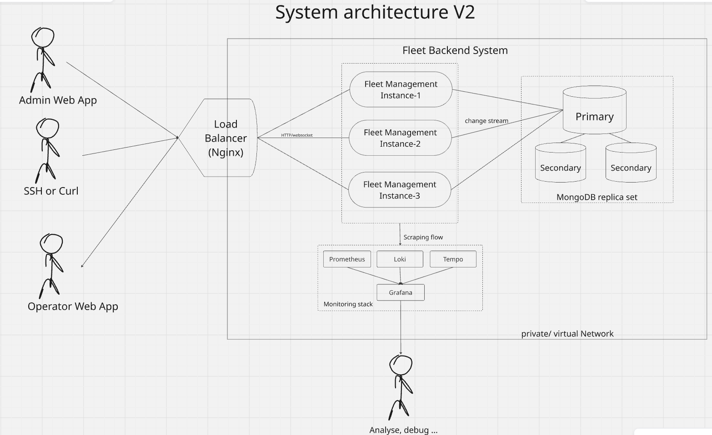
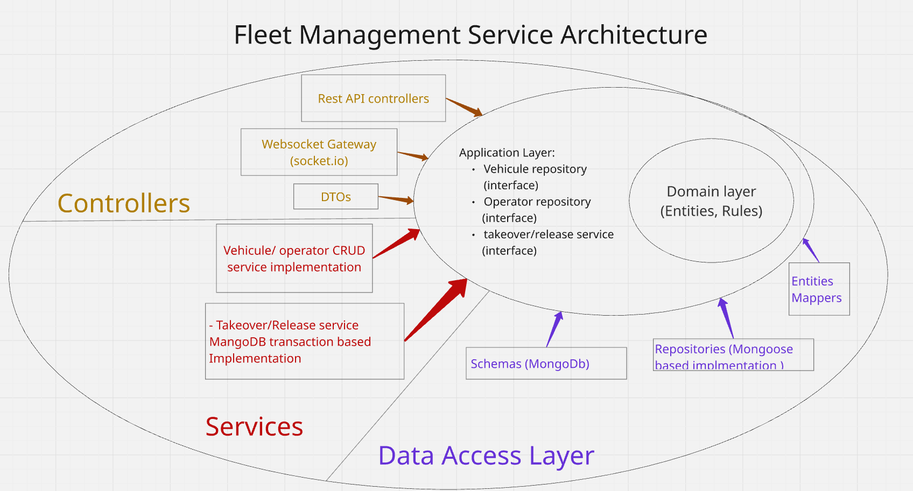

# Bliq

Remote fleet control — a small service and two web dashboards that let a pool
of remote operators sign in, pick a vehicle from the fleet, and operate it,
with hard guarantees that no two operators ever hold the same vehicle at the
same time.

- **Backend** (`apps/backend`): NestJS + MongoDB. Vehicle & operator CRUD,
  transactional takeover / release, WebSocket real-time updates.
- **Operator dashboard** (`apps/operator-dashboard`): React + Vite. Operators
  sign in, take over vehicles, release them. Live via WebSocket by default,
  falls back to HTTP polling automatically.
- **Admin dashboard** (`apps/admin-dashboard`): React + Vite. Add vehicles,
  toggle connectivity, delete. Polling only — kept intentionally simple.

## Table of contents

1. [Quick start](#quick-start)
2. [Definition of done](#definition-of-done)
3. [Requirements](#requirements)
4. [Repository layout](#repository-layout)
5. [System architecture](#system-architecture)
6. [Fleet management service architecture](#fleet-management-service-architecture)
7. [Concurrency & consistency](#concurrency--consistency)
8. [API reference](#api-reference)
9. [Real-time updates](#real-time-updates)
10. [Testing](#testing)
11. [Observability](#observability)
12. [Containerised components](#containerised-components)
13. [Contribution workflow](#contribution-workflow)
14. [Assumptions & optional paths taken](#assumptions--optional-paths-taken)
15. [Future optimisations](#future-optimisations)

---

## Quick start

Prerequisites: **Node 22**, **Docker** with Compose v2 (for MongoDB).

```bash
# Once, on a fresh clone:
npm run install:all

# Every time you want to work:
npm run dev
```

`npm run dev` starts the whole stack in one shot:

1. `docker compose up -d --wait` boots MongoDB as a single-node replica set
   and blocks until the healthcheck reports healthy (transactions require a
   replica set — the compose healthcheck also runs `rs.initiate()` on first
   start, so no manual step is needed).
2. `concurrently` launches three dev servers side by side:
   - **backend** on `http://localhost:3000`
   - **operator dashboard** on `http://localhost:5173`
   - **admin dashboard** on `http://localhost:5174`

Ctrl+C stops all three. Mongo keeps running — use `npm run docker:down` to
shut it down, or `npm run docker:reset` to wipe the volume and restart fresh
(re-seeds operators on the next boot).

Once running:

- Open the **operator dashboard** at `:5173`, pick a seeded operator, and use
  the fleet. It defaults to WebSocket mode with a live event log.
- Open the **admin dashboard** at `:5174` to add vehicles and toggle their
  connectivity.
- Open the **Swagger UI** at `:3000/docs` for the full API reference with
  live examples (dev-only — disabled when `NODE_ENV=production`).

---

## Definition of done

### Functional requirements

| # | Requirement | Notes |
|---|-------------|-------|
| 1 | Vehicle CRUD | `POST /vehicles`, `GET /vehicles`, `GET /vehicles/:id`, `PATCH /vehicles/:id`, `DELETE /vehicles/:id`, `PATCH /vehicles/:id/connectivity` |
| 2 | Operator CRUD | Operators are seeded on boot (4 fixed operators). Read-only `GET /operators` + `GET /operators/:id` API. See [Assumptions](#assumptions--optional-paths-taken) for rationale. |
| 3 | Vehicle takeover / release | `POST /fleet-management/takeover`, `POST /fleet-management/release` with the acting operator identified by `X-Operator-Id` header |

### Invariants that must always hold

These three invariants must be unbreakable under any concurrent load:

- **I1** — A vehicle is assigned to **at most one** operator at any point in time.
- **I2** — An operator holds **at most one** vehicle at any point in time.
- **I3** — A vehicle **cannot go offline** while it is assigned; the operator must release it first.

Business rules encode preconditions that protect these invariants:

- A vehicle can only be taken over if it is **online** and **unassigned**.
- An operator can only take a vehicle if they currently hold **no vehicle**.
- A vehicle can only go offline if it is **unassigned**.

Where the rules live and how they are enforced at runtime is described in
[Fleet management service architecture](#fleet-management-service-architecture)
and [Concurrency & consistency](#concurrency--consistency).

---

## Requirements

### Non-functional requirements

| Dimension | Target | Implementation |
|-----------|--------|----------------|
| **CAP** | Consistency **>>** Availability | Reads from primary only; MongoDB transactions with `majority` write concern. If all replicas are down the service returns an error — it never serves stale takeover state. |
| **Real-time / latency** | Sub-second vehicle state propagation to connected clients | MongoDB change streams → `EventEmitter2` → socket.io broadcast. p95 UI update < 1 s for up to a few hundred connected clients. |
| **Extensibility** | SOLID, independently replaceable components | Clean architecture (see [service architecture section](#fleet-management-service-architecture)). |
| **API contract** | Explicitly typed request / response shapes | Swagger UI at `/docs` (dev), class-validator DTOs, stable typed error codes. |
| **SLOs** | Uptime 99.9%, p95 response time ≤ 5 s, WebSocket with polling fallback | v1 is a single backend; see v2 for the infrastructure path to 99.9%. Fallback polling at 5 s is implemented in the operator dashboard. |
| **Observability** | Unified monitoring across components | Structured `NestLogger`, `LoggingInterceptor` on every HTTP request, gateway lifecycle events. See [Observability](#observability) for the production roadmap. |

---

## Repository layout

```
bliq/
├── apps/
│   ├── backend/                 NestJS API + WebSocket gateway
│   ├── operator-dashboard/      Vite + React, operator UI
│   └── admin-dashboard/         Vite + React, admin UI
├── static/
│   └── images/                  Architecture diagrams referenced in this README
├── docker-compose.yml           Mongo replica set with self-initiating healthcheck
├── package.json                 Root scripts + dev tooling (husky, lint-staged, commitlint)
├── .github/                     CI workflow, PR template, CODEOWNERS, branch protection recipe
├── .husky/                      pre-commit (prettier), commit-msg (commitlint)
└── README.md
```

### Backend layers

```
apps/backend/src/
├── domain/                  Entities, rule predicates, repository & service abstracts,
│                            typed DomainError hierarchy. Pure TypeScript, no framework.
├── data-access/             Mongoose schemas, mappers, repository implementations,
│                            change-stream watcher.
├── services/                Cross-aggregate implementations that need infra
│                            (currently: MongoFleetAssignmentService with transactions).
├── apis/                    Controllers, DTOs, feature modules, WebSocket gateway,
│                            exception filter, interceptor, metrics providers.
└── main.ts                  Global pipes, filter, interceptor, Swagger (dev-only), CORS.
```

Dependency direction is inward-only: `apis → services → domain ← data-access`.
`domain` imports from nothing. `data-access` and `services` import from
`domain` (for entities, rules, contracts). `apis` imports from all three.

---

## System architecture

### Version 1 — monolith



**Components:**
- One **NestJS** monolith handling all HTTP and WebSocket traffic.
- One **MongoDB** instance (single-node replica set — required for transactions
  even in dev; see compose setup).

**Why MongoDB?**

MongoDB's document model is a natural fit here because the vehicle and operator
relationship is deliberately denormalised: `vehicle.assignedOperatorId` and
`operator.currentVehicleId` mirror each other in two documents. This means:

- "Who is driving vehicle X?" is answered by reading one document — no join.
- "What vehicle is operator Y holding?" is answered by reading one document —
  no join.
- The fleet dashboard gets the full current state in a single collection scan.

The trade-off is maintaining that denormalisation, which is exactly the
concurrency problem solved by transactions (see
[Concurrency & consistency](#concurrency--consistency)).

MongoDB's change streams provide the real-time propagation layer without a
separate message broker — the backend subscribes to its own write log and fans
out to WebSocket clients.

**Limits of v1:**
- **Single point of failure** — one backend, one Mongo instance. Any crash
  takes down the entire service.
- **No zero-downtime deploys** — a restart disconnects all WebSocket clients
  and interrupts any in-flight request.
- **No horizontal scaling** — the WebSocket state is in memory; a second
  backend instance would not share it.
- **No A/B testing or canary deploys** — impossible without a load balancer
  in front.

---

### Version 2 — replicated



**Changes over v1:**
- **MongoDB replica set (3 nodes)** with `majority` write concern — a write is
  only acknowledged after at least 2 of 3 nodes have persisted it. The primary
  can crash and a secondary promotes automatically without data loss.
- **3 NestJS instances** behind a load balancer. Each instance runs its own
  MongoDB change stream and broadcasts to its own connected WebSocket clients.
  Adding a socket.io Redis adapter propagates broadcasts cluster-wide.
- **Nginx** as a reverse proxy and load balancer: TLS termination, sticky
  sessions for WebSocket connections (or use the Redis adapter to make sessions
  stateless), and health-check-based failover.

**Limits of v2:**
- **Load balancer is still a single point of failure** — mitigated with an
  active-passive Nginx pair or a cloud load balancer (ALB, GCP LB).
- **No database sharding** — once the vehicles collection grows into the
  millions, a sharded cluster becomes necessary. At fleet management scale
  this is unlikely to be the first bottleneck.
- **Change stream duplication** — 3 NestJS instances each run their own stream
  and each broadcast to their clients. This is fine with a Redis adapter but
  could be restructured into a dedicated broadcaster tier.

---

## Fleet management service architecture



### Clean architecture

The service is structured around clean architecture: outer layers depend on
inner layers, never the reverse.

```
┌──────────────────────────────────────┐
│  apis/        (HTTP, WebSocket, DTOs)│  ← outermost, depends on everything
├──────────────────────────────────────┤
│  services/    (cross-aggregate logic)│
├──────────────────────────────────────┤
│  data-access/ (Mongo, schemas)       │  ← depends on domain only
├──────────────────────────────────────┤
│  domain/      (entities, rules, ports│  ← innermost, depends on nothing
└──────────────────────────────────────┘
```

Benefits:
- **Swappable infrastructure** — replacing MongoDB with PostgreSQL only touches
  `data-access/`. The domain, services, and API layers are unaffected.
- **Business rules in one place** — `domain/*/rules.ts` holds pure functions
  that are reused by the service layer, the exception filter, and tests.
- **Team isolation** — teams owning different layers can evolve them
  independently without stepping on each other.
- **Independent testability** — domain rules are tested with no framework,
  no DB, no mocks.

**Where clean architecture is intentionally broken:**
`MongoFleetAssignmentService` lives in the `services/` layer but depends
directly on `mongoose.ClientSession` (a data-access detail) to open
transactions. This is an intentional boundary crossing: enforcing strong
consistency and low-latency concurrent writes requires coupling to the
database transaction primitive. Hiding it behind an additional abstraction
would only add indirection with no payoff.

### SOLID principles applied

**Single Responsibility** — each class has one reason to change. The
`VehicleRepository` fetches documents; the `VehicleMapper` converts between
Mongoose documents and domain entities; the `FleetAssignmentService` enforces
business rules; the `VehiclesController` handles HTTP concerns.

**Open/Closed** — adding a new domain error means adding a new class in
`domain/errors/` and a new entry in the `kind → HTTP status` table in the
exception filter. No existing class is modified.

**Interface Segregation** — `IVehicleRepository` exposes only the methods the
service layer needs. The concrete Mongoose implementation satisfies the
interface; consumers depend on the interface, never the implementation.

**Dependency Inversion** — the most heavily used principle. The service layer
declares what it needs (`IVehicleRepository`, `IOperatorRepository`,
`IFleetAssignmentService`) as abstract contracts. NestJS's IoC container
resolves the concrete implementations at startup. Nothing in `services/` or
`domain/` imports from `data-access/` or `apis/` — direction is enforced by
the import graph.

NestJS's `@Injectable()` and module providers handle the dependency injection
plumbing. Swapping in a test double is done at the module level, not by
patching imports.

### Vehicle & operator entities

- **Vehicle** — `{ id, name, connectivityStatus: 'online' | 'offline', assignedOperatorId: string | null }`.
- **Operator** — `{ id, name, currentVehicleId: string | null }`.

`assignedOperatorId` on the vehicle and `currentVehicleId` on the operator are
deliberately denormalised — the same relationship expressed twice. This makes
the "at most one vehicle per operator" invariant enforceable with a single
guarded write on the operator document, and lets both the UI and the API
answer "who is driving what" in one document read.

### Domain rules

Business rules live as pure functions in `domain/*/rules.ts` — one source of
truth, reusable from the service layer, the exception filter, and tests:

- `canBeAssigned(vehicle)` — vehicle is online AND unassigned
- `canGoOffline(vehicle)` — vehicle is unassigned
- `canClaimVehicle(operator)` — operator holds no vehicle
- `isHolding(operator, vehicleId)` — operator currently holds this vehicle

### Domain errors → HTTP

Domain-level errors are typed and carry two stable fields:

- `code` (`VEHICLE_OFFLINE`, `VEHICLE_ALREADY_ASSIGNED`,
  `OPERATOR_ALREADY_HAS_VEHICLE`, `VEHICLE_NOT_HELD_BY_OPERATOR`,
  `VEHICLE_NOT_FOUND`, `OPERATOR_NOT_FOUND`)
- `kind` (`'not-found' | 'conflict' | 'invalid' | 'unauthorized' | 'forbidden'`)

A global `DomainExceptionFilter` maps `kind` to HTTP status via a small closed
table and returns `{ statusCode, code, message }`. Adding a new domain error
never touches the filter — the mapping is by category, not per-code. The
filter guards on `host.getType()` so a future non-HTTP transport (WebSocket
handlers, RPC) doesn't get an accidental HTTP response applied to it.

The frontend switches on `code` (not on English message text) to render
specific rejection reasons in toasts.

---

## Concurrency & consistency

Three invariants have to hold under any sequence of concurrent requests:

1. A vehicle is assigned to at most one operator at any time.
2. An operator holds at most one vehicle at any time.
3. A vehicle cannot be offline while assigned.

### Why the naïve solution doesn't work

A naïve implementation might:

1. Read the vehicle document — check it is online and unassigned.
2. Read the operator document — check they hold no vehicle.
3. Write the vehicle: set `assignedOperatorId`.
4. Write the operator: set `currentVehicleId`.

Under concurrent requests this produces **lost updates**:

```
Time  Request A (Op1 → V1)         Request B (Op2 → V1)
  1   read V1  → unassigned        read V1  → unassigned   (both see "free")
  2   check rules → pass           check rules → pass
  3   write V1.assignedOperatorId = Op1
  4                                write V1.assignedOperatorId = Op2  ← overwrites!
  5   write Op1.currentVehicleId = V1
  6                                write Op2.currentVehicleId = V1
  →   Both operators now hold V1. Invariant I1 broken.
```

### How consistency is enforced

**Takeover / release — MongoDB multi-document transaction:**

`MongoFleetAssignmentService` opens a MongoDB `ClientSession` and wraps the
entire read-check-write sequence in `session.withTransaction`:

- Both reads use `.session(session)` so they observe a **consistent snapshot**
  (MongoDB uses MVCC — snapshot isolation is the default for multi-document
  transactions).
- Rule predicates from `domain/*/rules.ts` run against the snapshot.
- Both writes happen inside the same transaction with `majority` write concern.
- If two concurrent transactions target the **same document**, MongoDB detects
  the write conflict and automatically retries the loser.
- On retry, the loser's fresh read observes the winner's committed state; the
  rule check now fails; the transaction aborts with a typed `DomainError`. No
  partial writes, no silent lost update.

**Connectivity toggle — single-document atomic guard:**

```ts
findOneAndUpdate({ _id, assignedOperatorId: null }, { connectivityStatus: 'offline' })
```

If a race is lost (the vehicle was just taken) the update matches nothing and
the caller re-reads and produces a precise `VEHICLE_ALREADY_ASSIGNED` error.

### Consistency model

| Scope | Guarantee |
|-------|-----------|
| Takeover / release | Strong — all reads from primary within session; both writes commit together or neither does |
| Connectivity toggle | Atomic — single guarded `findOneAndUpdate` |
| Client UI | Eventually consistent — WebSocket clients receive `vehicle.changed` within tens of milliseconds; polling clients within 5 seconds |

Any client acting on stale UI is safely rejected by the backend with a domain
error code the client can display.

### Limits of the transactions approach

- **Consistency is tied to the database** — the invariants are enforced inside
  MongoDB. A service that bypasses the backend and writes directly to the
  collection breaks the guarantees.
- **Transactions don't cross service boundaries** — if a second service (e.g.,
  a billing service) needs to participate in the same atomic operation,
  MongoDB transactions can't span it. A saga pattern or an outbox pattern
  would be needed.
- **Throughput** — multi-document transactions add latency (round-trip + lock
  acquisition). For the expected fleet management scale (hundreds of operators,
  not hundreds of thousands) this is fine. At higher throughput, the next step
  would be:

### Alternative: distributed locking with Redis

For invariants that span multiple services or data stores, a Redis-based mutex
(`SET NX PX` / Redlock) can serve as a general-purpose concurrency primitive:

```
acquire lock(vehicle_id) → run business logic → release lock
```

Trade-offs vs. the current approach:

| | MongoDB transactions | Redis distributed lock |
|---|---|---|
| Scope | Single MongoDB cluster | Cross-service, cross-DB |
| Failure mode | Transaction aborted, client retries | Lock holder crash → TTL expiry |
| Latency | 1–2 extra round-trips | 1–2 extra round-trips + Redis hop |
| Complexity | Built-in, no new infra | Requires Redis, lock TTL tuning, fencing tokens |
| Current fit | ✅ right for this system | Over-engineered for this system |

The Redis approach becomes the right choice once the consistency boundary needs
to cross a service edge (e.g., a dedicated assignment service + a billing
service that charges per-minute of vehicle occupancy both need to agree on the
same transaction).

---

## API reference

Full Swagger UI at [`/docs`](http://localhost:3000/docs) in dev.

### Vehicles CRUD

| Method | Path                              | Body                     | Response |
| ------ | --------------------------------- | ------------------------ | -------- |
| GET    | `/vehicles`                       | —                        | `Vehicle[]` |
| POST   | `/vehicles`                       | `{ name }`               | `Vehicle` |
| GET    | `/vehicles/:id`                   | —                        | `Vehicle` |
| PATCH  | `/vehicles/:id`                   | `{ name? }`              | `Vehicle` |
| DELETE | `/vehicles/:id`                   | —                        | `204` |
| PATCH  | `/vehicles/:id/connectivity`      | `{ status: 'online' \| 'offline' }` | `Vehicle` |

### Operators (read-only, seeded on boot)

| Method | Path                | Response |
| ------ | ------------------- | -------- |
| GET    | `/operators`        | `Operator[]` |
| GET    | `/operators/:id`    | `Operator` |

### Fleet management (takeover / release)

Both endpoints require an `X-Operator-Id: <objectId>` header identifying the
acting operator (a stand-in for auth — see [Assumptions](#assumptions--optional-paths-taken)).

| Method | Path                              | Headers            | Body           | Response |
| ------ | --------------------------------- | ------------------ | -------------- | -------- |
| POST   | `/fleet-management/takeover`      | `X-Operator-Id`    | `{ vehicleId }` | `Vehicle` |
| POST   | `/fleet-management/release`       | `X-Operator-Id`    | `{ vehicleId }` | `Vehicle` |

### Error response shape

Every domain rule violation returns a JSON body with a stable machine code:

```json
{
  "statusCode": 409,
  "code": "VEHICLE_ALREADY_ASSIGNED",
  "message": "Another operator is holding this vehicle"
}
```

Both frontends switch on `code` to render specific rejection reasons.

---

## Real-time updates

The operator dashboard subscribes to a WebSocket namespace `/realtime` and
receives:

- `vehicles.snapshot` (on connect): current full list
- `vehicle.changed` (broadcast): `{ kind: 'created'|'updated'|'deleted', vehicleId, vehicle }`

### Server-side pipeline

1. **`VehicleChangeStreamWatcher`** in `data-access/vehicles/` opens a MongoDB
   change stream on the vehicles collection when the first WebSocket client
   connects, and stops it when the last one disconnects. No idle Mongo cursor
   when no one is watching.
2. Each raw Mongo event is translated to a domain `VehicleChangedEvent` and
   emitted on the app-wide `EventEmitter2`. This decouples the data-access
   watcher from the WebSocket gateway — neither knows about the other.
3. **`VehiclesGateway`** in `apis/vehicles/` subscribes with
   `@OnEvent('vehicle.changed')` and broadcasts to every socket in `/realtime`.

Using change streams as the event source means **every write** is captured
regardless of who wrote it — a service, an admin CLI, or another backend
instance. This also makes horizontal scaling straightforward: each backend
instance runs its own stream and broadcasts to its own connected clients. A
socket.io Redis adapter propagates the broadcast cluster-wide (see v2 notes).

### Frontend fallback

The operator dashboard defaults to WebSocket. If the initial connect fails
(or all reconnect attempts are exhausted mid-session), it falls back to
5-second HTTP polling and shows an error toast with the underlying reason.
Users can retry WebSocket by clicking the toggle in the header.

---

## Testing

```bash
npm --prefix apps/backend test
```

Three suites, ~15 seconds total against `mongodb-memory-server`.

### Strategy

- **Domain rules** (`vehicle.rules.spec.ts`, `operator.rules.spec.ts`) — pure
  unit tests for the rule predicates. No mocks, no framework, no DB. These
  test the invariant logic in total isolation.

- **Assignment service** (`mongo-fleet-assignment.service.spec.ts`) —
  integration tests against a real single-node MongoDB replica set spun up
  by `mongodb-memory-server`. This is where the interesting guarantees live:
  - Full takeover decision table (happy path + every rule violation)
  - Every failure path also asserts the DB state was **not** mutated
    (atomicity is the invariant being tested, not just the error thrown)
  - Release happy path + non-holder rejection
  - **Two concurrency tests**:
    - Two operators race for the same vehicle → exactly one wins, the loser
      receives `VehicleAlreadyAssignedError`, the loser's `currentVehicleId`
      remains `null`.
    - One operator races to take two different vehicles simultaneously →
      exactly one wins, the loser receives `OperatorAlreadyHasVehicleError`,
      the loser vehicle stays unassigned.

The concurrency tests prove both sides of the "at most one" invariant under
real contention. They could not be written with fakes — the guarantee lives
in the transaction protocol, not in application code.

### What is not tested (and why)

Controllers, DTOs, and CRUD are not directly unit-tested. They would either
repeat framework behaviour (class-validator, Nest routing) or verify an obvious
delegation. Coverage-driven testing is deliberately avoided; the test surface
is chosen by where real risk lives.

---

## Observability

Current implementation:

- **Nest `Logger`** with structured levels: `LOG` for normal operations,
  `WARN` for expected-but-noteworthy events (slow HTTP requests, domain
  rule rejections), `ERROR` for unexpected failures with stack traces.
- **`LoggingInterceptor`** wraps every HTTP request with method, URL,
  status/code, and duration. Requests over 500 ms are logged at `WARN`.
- **Change stream watcher and WebSocket gateway** log their own connect /
  disconnect lifecycle events with client id and current count.

Production roadmap (see also [Future optimisations](#future-optimisations)):

- **Prometheus `/metrics` endpoint** — Node runtime metrics, an
  `http_request_duration_seconds` histogram, a
  `fleet_assignment_operations_total{operation, outcome}` counter keyed by
  the domain error code, and a `fleet_websocket_connections` gauge.
- **Structured JSON logs** via Pino → Promtail → Loki for cross-instance
  search; correlation ids via `AsyncLocalStorage`.
- **OpenTelemetry traces** once a second service boundary exists.
- **Grafana** dashboards for latency percentiles, takeover success rate by
  outcome code, and live WebSocket client count.

---

## Containerised components

The current `docker-compose.yml` runs MongoDB as a single-node replica set
with a healthcheck that also handles first-time `rs.initiate()`. `npm run dev`
blocks on the healthcheck so the backend never races an unready database.

The three application components (backend, operator dashboard, admin dashboard)
are run as Node/Vite dev servers locally. Dockerising them for a production
build would involve:

- **Backend**: multi-stage `Dockerfile` (`node:22-alpine` build + distroless
  runtime), environment variables for `MONGO_URI`, `PORT`, `NODE_ENV`.
- **Frontends**: build with `vite build`, serve the `dist/` output via nginx
  or a CDN — the Vite build is a static bundle with no runtime Node.
- **Compose (v2)**: extend `docker-compose.yml` with service definitions for
  all components plus Nginx as a reverse proxy, enabling the v2 architecture
  locally with `docker compose up --scale backend=3`.

---

## Contribution workflow

The repo is set up as if a small team is collaborating on it.

- Feature branches, PR-only merges. `main` is protected — CI must be green
  and a Code Owner must approve before merging.
- Commit messages follow **Conventional Commits** with a repo-specific scope
  allowlist (`backend | operator-dashboard | admin-dashboard | repo | ci | docs`),
  enforced locally by a husky `commit-msg` hook and in CI on every PR.
- Local `pre-commit` hook runs Prettier on staged files via `lint-staged`.
- CI runs on every PR only (not on push to `main`): backend typecheck +
  lint + tests, frontend typecheck + build, commit range linting.
- Type safety is enforced at both compile time (TypeScript strict mode) and
  CI — the pipeline fails if `tsc --noEmit` reports errors.
- See [`.github/BRANCH_PROTECTION.md`](.github/BRANCH_PROTECTION.md) for the
  one-time GitHub UI settings that turn the ruleset above into hard gates.

---

## Assumptions & optional paths taken

The prompt allows a few explicit choices — this is what I took:

- **Database**: MongoDB (single-node replica set locally, required for the
  multi-document transactions the fleet-management flow uses).
- **Operators**: seeded on startup via `OperatorsSeed` (`OnApplicationBootstrap`).
  Four fixed operators — no CRUD API. Rationale: keep the surface focused on
  the actual challenge — the assignment lifecycle.
- **Auth**: the prompt allows using an operator id in the request to identify
  who is acting. Implemented as an `X-Operator-Id` HTTP header (not the
  request body), extracted by a custom `@OperatorId()` parameter decorator.
  Rationale: when JWT auth lands, only the decorator body swaps to
  `request.user.operatorId` — controllers and downstream code stay identical.
- **Frontend**: two separate Vite + React apps, one per audience (operators
  and admins). Rationale: different mental model, different eventual auth
  scope, different deploy artefacts. Sharing infra between them is easy;
  merging them would be a lie about who they serve.
- **Real-time**: MongoDB change streams + `@nestjs/event-emitter` + socket.io.
  Change streams as the source of truth means the fan-out is captured for every
  write regardless of who wrote it, and horizontal scaling is straightforward.
- **Not implemented**: real auth, response DTOs (controllers return the domain
  entity directly — its shape is flat and already API-appropriate), pagination
  on `GET /vehicles`, structured JSON logs.

---

## Future optimisations

### API surface

- **Response DTOs** with a derived `status: 'offline' | 'available' | 'in_use'`
  field so the frontend renders from a single field instead of computing
  from `(connectivityStatus, assignedOperatorId)`.
- **Pagination + filtering** on `GET /vehicles` (`?limit`, `?cursor`,
  `?status`, `?region`) once the fleet grows past a screenful.
- **Audit log**: an append-only `assignments` collection recording every
  takeover, release, and connectivity change with actor + timestamp.

### Consistency & concurrency hardening

- **Partial unique index** on `operators.currentVehicleId` and
  `vehicles.assignedOperatorId` (`partialFilterExpression: { $type: 'objectId' }`)
  — DB-level defence in depth against a hypothetical bug in the rule check.
- **Idempotency keys** on takeover / release so a retried request after a
  network blip is safely no-op instead of racing.
- **Exponential backoff with jitter** on the client side for transient errors,
  replacing the current "show error toast" UX for network failures.
- **Distributed locking (Redis / Redlock)** once invariants need to span
  multiple services — see [Concurrency & consistency](#concurrency--consistency)
  for a detailed trade-off comparison.

### Authentication & authorisation

- Move from the `X-Operator-Id` header to a JWT bearer token issued by an
  identity provider. The `@OperatorId()` decorator becomes a one-liner reading
  `request.user.operatorId` — controllers unchanged. Add a `JwtAuthGuard`
  (global with `@Public()` opt-out) and role-based guards for admin endpoints.
  WebSocket handshakes carry the token in `socket.handshake.auth.token`.

### Real-time & scaling

- **socket.io Redis adapter** with sticky-session LB routing once there is
  more than one Nest instance.
- **Dedicated broadcaster tier** at ~10+ instances: 2–3 instances own the
  change stream and publish to Redis; gateway instances stay thin.
- **Change stream resume tokens** persisted (Redis or Mongo) so a watcher
  restart doesn't drop events between crash and reconnect.
- **Server-side sequence numbers** on WebSocket messages so clients can detect
  gaps and re-fetch snapshots.

### Quality & automation

- **CD pipeline** triggered on `main` merge — build Docker images, push to
  registry, deploy to staging, run smoke tests.
- **E2E tests** (Playwright) through the full stack proving the `code` field
  surfaces to the operator dashboard UI for each domain error.
- **Chaos / load testing** simulating > 30 000 concurrent operators to stress
  the WebSocket layer and the MongoDB transaction throughput ceiling.
- **SonarCloud** or **Semgrep** on PRs for code smells and security hotspots.
- **Dependabot** for automated dependency updates.
- **CodeQL** on PRs for security scanning (free GitHub Actions).
- **`eslint-plugin-boundaries`** to programmatically enforce the layer rules
  (`data-access` cannot import from `apis`, etc.) — makes the layering
  structurally enforced rather than convention.

### Developer experience

- **`.claude/` agents and skills** — structured prompts and tools so AI
  assistants can be reliably integrated into the development workflow, reducing
  context ramp-up time and boosting productivity on routine tasks (adding a new
  endpoint, writing tests for a new domain rule, etc.).
- **Production-readiness checklist**: structured JSON logs, secrets management
  (Vault or AWS Secrets Manager), container health endpoints, graceful shutdown
  with in-flight request draining, database connection pooling tuned for
  concurrent transaction load.
